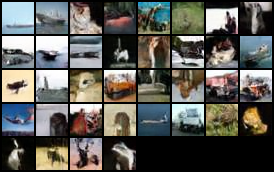

# diffusion

Copied from 
https://www.assemblyai.com/blog/diffusion-models-for-machine-learning-introduction/

Experiments in NN diffusion models

Overtrained network which is memorizing test set.  Trained on CIFAR10 test images of airplanes on 8GB 2080GPU
Current results are entirely from the above introduction running on a different dataset...  Planning some additional work here and trying on high order networks.

